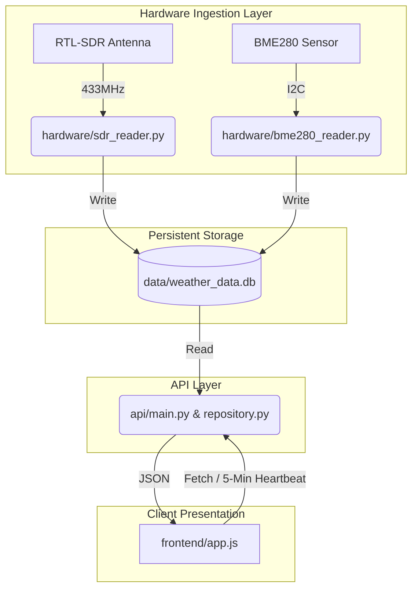

# RTL-SDR Local Weather Station Dashboard on Raspberry Pi

Thanks for checking out my project! I should emphasize this is a hobby project to track weather data from your own weather sensors. As such, please use the code at your own risk as there is no guarantee the code is stable or reliable. With that said, I have attempted to design the most robust and clean architecture possible. It has been a wonderful learning experience in many ways! 

Essentially, this is a self-hosted weather dashboard powered by a Raspberry Pi. The Pi acts as both your database and web server, logging sensor readings every 5 minutes to SQLite and serving the UI across your local network. You can access it from any browser in your network. I specifically engineered the frontend to be compatible with iOS 12 so I could repurpose an old iPad as a dedicated display. But by no means do you need an old iPad to view the application; it should work on any modern device as well. I have attempted to design the database so that you can dynamically add as many sensors as you would like. Although, the displayed metrics are currently limited to Temperature, Humidity, Dew Point, Pressure, and Wind Speed. 


I want to accomplish three things with this README:

1. Clearly explain the **System Architecture & Data Flow** so you can understand the code.
2. Clearly explain the **Setup & Installation** so you can set this up yourself.
3. Clearly explain **How to Run the Tests**.

---

## System Architecture & Data Flow

To understand this codebase, please see diagram below. The system is intentionally decoupled into distinct layers to ensure that if the frontend crashes, the hardware keeps recording, and if the hardware dies, the API stays online.


1. Persistent Storage (The Heart)

    The SQLite database sits at the center of the application (data/weather_data.db). Take a look at init_db.py to see the schema. The readings table utilizes an Entity-Attribute-Value (EAV) model (a narrow table format where each row records a single metric, like temperature or wind speed, rather than having a wide table with a column for every possible metric). This allows you to dynamically add an infinite number of new sensors to the system without ever needing to alter the database schema.

2. Hardware Ingestion Layer (The Writers)

    The database is fed by hardware scripts located in the /hardware directory.

- bme280_reader.py directly reads barometric pressure, temperature and humidity from a sensor wired to the Raspberry Pi.

- sdr_reader.py listens to the 433MHz radio frequency to capture data transmitted wirelessly from your own outdoor sensors. This data is filtered through an in-memory throttle to prevent database bloat and is captured approximately every 5 minutes.

3. API Layer (The Readers)

    The API layer exposes endpoints for the frontend to pull data. Located in the /api directory, the main.py file handles the routing and business logic (such as converting raw pressure to Mean Sea Level Pressure). All SQL queries are strictly decoupled into repository.py to allow for clean, isolated unit testing.

4. Client Presentation (The UI)

    Located in the /frontend directory, the UI is driven entirely by vanilla JavaScript in app.js. If you want to understand how the dashboard updates, open app.js and scroll to the bottom. You will find the initialization functions (updateFixedSensorData() and initializeSensorDropdown()) and a setInterval() heartbeat that refreshes the data. From there, you can trace the API calls backward to the backend.

## Setup & Installation Guide
### 🛠️ Bill of Materials (BOM)
- Raspberry Pi (Tested on Pi 4/5 running Debian/Raspberry Pi OS)

- RTL-SDR USB Dongle (with 433MHz antenna)

- Weather Sensor (433MHz broadcast sensor)

- BME280 I2C Barometric Pressure Sensor

These instructions assume you are deploying this on a fresh Raspberry Pi.
### Hardware Wiring (BME280)
If you are incorporating the hardwired BME280 sensor, you must connect it to the Raspberry Pi's specific I2C pins. 

*Note: The below connection guide is for reference only and may be incorrect or vary depending on your specific hardware. Please double-check all connections before applying power to your Raspberry Pi.*

Connection Guide:
| BME280 Pin | Raspberry Pi Physical Pin | Function |
| :--- | :--- | :--- |
| **VIN / VCC** | Pin 1 (3.3V Power) | Supplies power to the sensor |
| **GND** | Pin 6 (Ground) | Completes the electrical circuit |
| **SDA** | Pin 3 (GPIO 2) | I2C Serial Data (carries the temperature readings) |
| **SCL** | Pin 5 (GPIO 3) | I2C Serial Clock (keeps the devices synchronized) |

**Enable I2C on the Raspberry Pi:**
By default, the I2C hardware interface is turned off on a fresh Raspberry Pi. To enable it, run the configuration tool in your terminal:
`sudo raspi-config`
Navigate to **Interface Options** -> **I2C** -> Select **Yes** to enable. You will need to reboot the Pi for this to take effect.


### 1. System Dependencies

Install the required system packages, including the rtl_433 C-program used to decode the radio waves.

```bash
sudo apt-get update
sudo apt-get install rtl-433 python3-venv sqlite3
```
### 2. Clone & Environment Setup

Clone the repository and build an isolated Python environment so we don't pollute the Pi's global packages.
```bash
git clone https://github.com/Simon-Fukada/weather_station.git
cd weather_station
python3 -m venv venv
source venv/bin/activate
pip install -r requirements.txt
```

### 3. Discover Your Sensors (Airwave Sniffing)
(Note: If you are only using the hardwired BME280 sensor, you can skip to Step 4).

Before you can configure the database, you need to know the unique digital IDs of your physical wireless sensors.

Make sure your RTL-SDR dongle is plugged in, and run the rtl_433 program directly in your terminal to find your weather sensor id:
```bash
rtl_433
```

Watch the screen until your sensor broadcasts its data. You will see an output block that looks something like this:
```
_ _ _ _ _ _ _ _ _ _ _ _ _ _ _ _ _ _ _ _ _ _ _ _ _ _ _ _ _ _ _ _ _ _ _ _ _
time      : 2026-03-28 12:00:00
model     : Your Sensor Model    id        : 12345
Temperature: 1.7 C         Humidity  : 49 %
```
Write down that id (e.g., 12345). Once you have it, press Ctrl + C to stop the listener.

### 4. Configuration & Database Seeding
First, set up your Environment Variable:
Copy the template file to create your active .env file.

```bash
cp .env.example .env
nano .env
```

Inside the .env file, simply provide your physical station elevation in meters (used to calculate Mean Sea Level Pressure).

```
STATION_ELEVATION=1045
```

Second, initialize the Database:
This creates the .db file and builds the required schema. (Ensure you have the virtual environment activated)

```bash
python init_db.py
```

(Note: You do not need to manually register the BME280; the script is designed to auto-register itself into the database the first time it runs. So if you are not using any SDR sensors you don't need to do the following step). 

Third, Register the Sensors in the Database:
The system requires you to explicitly register your SDR sensors. If an unregistered radio ID flies through the air, the database will silently reject it.

Open the SQLite terminal:

```bash
sqlite3 data/weather_data.db
```

Insert your sensors into the table. If you have multiple sensors, repeat the insert into step below for each one. 
(Important: The machine_name you insert here must perfectly match the physical id you found in Step 3!) 

```sql
-- Example: Registering an outdoor SDR sensor (Physical ID 12345)
INSERT INTO sensors (machine_name, friendly_name, location) 
VALUES ('12345', 'Outside (Tree)', 'Backyard');

-- Type .exit and press Enter to leave the SQLite terminal
.exit
```

### 5. Running as Background Services (systemd)

To make this system bulletproof, we hand control of the Python scripts over to Linux systemd. This ensures they automatically boot up if the Pi loses power, and automatically restart if they crash.

Required: Create the API Service
This keeps your web dashboard online.
```bash
sudo nano /etc/systemd/system/weather-api.service
```

Paste the following (adjust /home/YOUR_USER to your actual path):


```ini

[Unit]
Description=Weather Station FastAPI Backend
After=network.target

[Service]
User=YOUR_USER
WorkingDirectory=/home/YOUR_USER/weather_station
ExecStart=/home/YOUR_USER/weather_station/venv/bin/uvicorn api.main:app --host 0.0.0.0 --port 8000
Restart=always

[Install]
WantedBy=multi-user.target
```

Optional: Create the SDR Hardware Service
(Only required if using an RTL-SDR dongle for wireless sensors).
```bash
sudo nano /etc/systemd/system/weather-sdr.service
```
Paste the following:
```ini
[Unit]
Description=Weather Station SDR Listener
After=network.target

[Service]
User=YOUR_USER
WorkingDirectory=/home/YOUR_USER/weather_station
ExecStart=/home/YOUR_USER/weather_station/venv/bin/python hardware/sdr_reader.py
Restart=always

[Install]
WantedBy=multi-user.target
```
Optional: Create the BME280 Cron Job
(Only required if using a hardwired I2C BME280 sensor).
Because the BME280 script is designed to run once and exit, we use a cron job to run it every 5 minutes, rather than a continuous service.

```bash
crontab -e
```
Add this line to the bottom of the file (adjusting the paths):
```
*/5 * * * * /home/YOUR_USER/weather_station/venv/bin/python /home/YOUR_USER/weather_station/hardware/bme280_reader.py
```

Run the following commands to start the services you created. (Note: If you didn't create the optional weather-sdr service, simply remove it from these commands).
```bash
sudo systemctl daemon-reload
sudo systemctl enable weather-api weather-sdr
sudo systemctl start weather-api weather-sdr
```
You can now view your live dashboard at http://[YOUR_PI_IP]:8000.
## Running Tests
The test suites are split between the Python backend and the JavaScript frontend.

Backend Tests (Python/FastAPI):
The backend utilizes pytest with in-memory SQLite databases to prevent polluting your production data.
```bash
source venv/bin/activate
pytest tests/
```

Frontend Tests (JavaScript/DOM):
The frontend logic is tested using the Jest framework. You will need Node.js installed on your machine to run these.
```bash
# First, install the necessary node modules
cd frontend
npm install

# Run the test suite
npx jest app.test.js
```