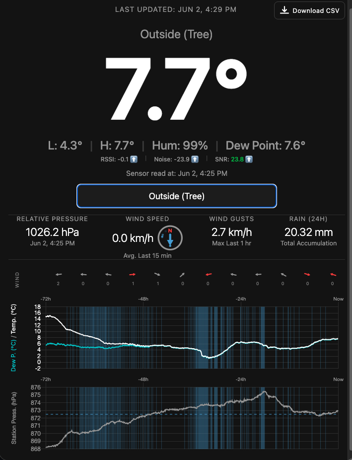
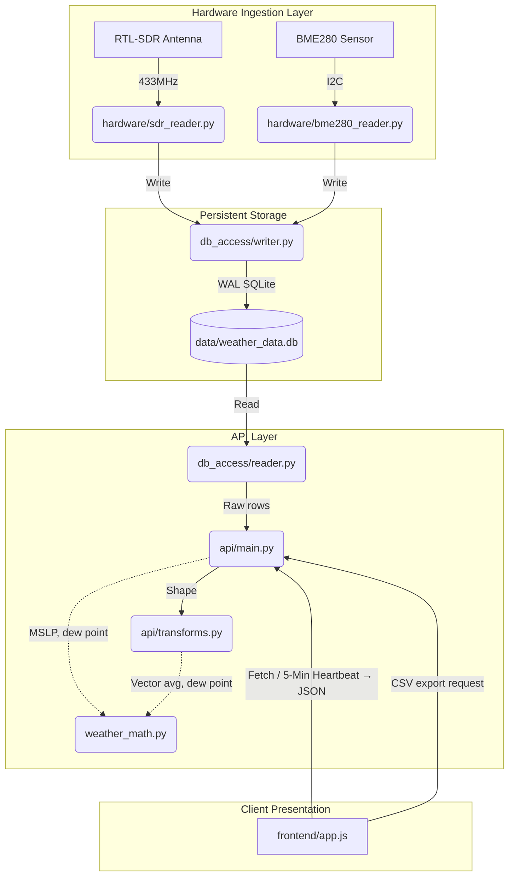

# RTL-SDR Local Weather Station Dashboard on Raspberry Pi

Thanks for checking out my project! I should emphasize this is a hobby project to track weather data from your own weather sensors. As such, please use the code at your own risk as there is no guarantee the code or any of the calculations or instructions in this readme are stable or reliable. With that said, I have attempted to design the most robust and clean architecture possible. It has been a wonderful learning experience in many ways! 

Essentially, this is a self-hosted weather dashboard powered by a Raspberry Pi. The Pi acts as both your database and web server, logging sensor readings every 5 minutes to SQLite and serving the UI across your local network. You can access it from any browser in your network. I specifically engineered the frontend to be compatible with iOS 12 so I could repurpose an old iPad as a dedicated display. But by no means do you need an old iPad to view the application; it should work on any modern device as well. I have attempted to design the database so that you can dynamically add as many sensors as you would like. Currently, the dashboard tracks the following metrics (Temperature, Humidity, Dew Point, Pressure, Rain, Wind Speed and Wind Direction), alongside a small Radio Frequency dashboard to keep an eye on your wireless connection health.




I want to accomplish three things with this README:

1. Clearly explain the **System Architecture & Data Flow** so you can understand the code.
2. Clearly explain the **Setup & Installation** so you can set this up yourself.
3. Clearly explain **How to Run the Tests**.

---

## System Architecture & Data Flow

To understand this codebase, please see diagram below. The system is intentionally decoupled into distinct layers to ensure that if the frontend crashes, the hardware keeps recording, and if the hardware dies, the API stays online.


1. Persistent Storage (The Heart)

    The SQLite database sits at the center of the application (data/weather_data.db). `init_db.py` is the authoritative schema source. The readings table utilizes an Entity-Attribute-Value (EAV) model (a narrow table format where each row records a single metric, like temperature or wind speed, rather than having a wide table with a column for every possible metric). This allows you to dynamically add an infinite number of new sensors to the system without ever needing to alter the database schema.

2. Hardware Ingestion Layer (The Writers)

    The database is fed by hardware scripts located in the /hardware directory.

    - bme280_reader.py directly reads barometric pressure, temperature and humidity from a sensor wired to the Raspberry Pi.

    - `sdr_reader.py` listens to the 433MHz radio frequency to capture data transmitted wirelessly from your own outdoor sensors. 


3. API Layer (The Readers)

    The API layer exposes endpoints for the frontend to pull data. Located in the /api directory, the main.py file handles the routing and business logic (such as converting raw pressure to Mean Sea Level Pressure).

4. Client Presentation (The UI)

    Located in the /frontend directory, the UI is driven entirely by vanilla JavaScript in app.js. If you want to understand how the dashboard updates, open app.js and scroll to the bottom. You will find the initialization functions (updateFixedSensorData() and initializeSensorDropdown()) and a setInterval() heartbeat that refreshes the data. From there, you can trace the API calls backward to the backend.

### Radio Frequency (RF) Signal Health

Because 433MHz wireless sensors are subject to environmental interference and battery degradation the dashboard includes an RF monitoring layer. 

The UI displays the three raw RF metrics calculated by the rtl_433 software: RSSI, Noise, and SNR. To make the Signal-to-Noise Ratio (SNR) easier to interpret at a glance, the values are colour-coded:

* **Green (SNR > 20 dB):** 
* **Yellow (SNR 10 - 20 dB):** 
* **Red (SNR < 10 dB):** 


**Signal Strength Trend:**
Additionally, trend arrows (`⬆️` / `⬇️` / `➖`) have been added to track signal health for the RSSI, Noise, and SNR. The logic looks at the past 6 hours of data. It takes the average value of the most recent 3 hours and compares it against the previous 3 hours. 

If the average decreases, a down arrow `⬇️` is displayed; if it increases, an up arrow `⬆️` is displayed. If there is no change, or if radio signal strength is not relevant to the current sensor, a neutral dash (`➖`) is displayed.

## Setup & Installation Guide
### 🛠️ Bill of Materials (BOM)
- Raspberry Pi (Tested on Pi 4/5 running Debian/Raspberry Pi OS)

- RTL-SDR USB Dongle (with 433MHz antenna)

- Weather Sensor (433MHz broadcast sensor)

- BME280 I2C Barometric Pressure Sensor

These instructions assume you are deploying this on a fresh Raspberry Pi.
### Hardware Wiring (BME280)
If you are incorporating the hardwired BME280 sensor, you must connect it to the Raspberry Pi's specific I2C pins. 

*Note: The below connection guide is for reference only and may be incorrect or vary depending on your specific hardware. Please double-check all connections before applying power to your Raspberry Pi.*

Connection Guide:
| BME280 Pin | Raspberry Pi Physical Pin | Function |
| :--- | :--- | :--- |
| **VIN / VCC** | Pin 1 (3.3V Power) | Supplies power to the sensor |
| **GND** | Pin 6 (Ground) | Completes the electrical circuit |
| **SDA** | Pin 3 (GPIO 2) | I2C Serial Data (carries the temperature readings) |
| **SCL** | Pin 5 (GPIO 3) | I2C Serial Clock (keeps the devices synchronized) |

**Enable I2C on the Raspberry Pi:**
By default, the I2C hardware interface is turned off on a fresh Raspberry Pi. To enable it, run the configuration tool in your terminal:
`sudo raspi-config`
Navigate to **Interface Options** -> **I2C** -> Select **Yes** to enable. You will need to reboot the Pi for this to take effect.

**I2C Address:**
Most BME280 modules ship with I2C address `0x76`, which is what the script expects. Some modules use `0x77` instead. If the sensor is wired correctly but not detected, open `hardware/bme280_reader.py` and change `BME280_ADDRESS = 0x76` to `BME280_ADDRESS = 0x77`.

**Personalising the sensor:**
Near the top of `hardware/bme280_reader.py` you will find the constant `SENSOR_MACHINE_NAME`. This is the lookup key the script uses to find its sensor row in the database — it must exactly match the `machine_name` value you insert during the database seeding step below. The friendly name and location are set in that SQL INSERT, not in the script.

**Self-healing hardware recovery:**
The BME280 script includes a three-tier recovery chain for I2C bus lockups: software retries with exponential backoff, a 9-clock-pulse hardware reset (I2C spec §3.1.16 via GPIO), and finally a kernel driver reset via `hardware/i2c_reset.sh`. Tiers one and two require no setup. Tier three (the kernel reset) is optional — if it is not configured, that step fails gracefully and the next cron invocation starts fresh.

**Optional: Setting up the kernel driver reset (`hardware/i2c_reset.sh`):**

This step is **disabled by default** because it resets the I2C-1 bus driver for all devices on the bus, not just the BME280. If you have other I2C devices wired to the same bus (a display, another sensor), they will briefly lose communication during the reset.

To enable it, set `ENABLE_I2C_DRIVER_RESET = True` in `config.py`, then complete the following setup:

Make the script executable:
```bash
chmod +x hardware/i2c_reset.sh
```

Allow it to run without a password prompt (required for cron — without this the step silently times out):
```bash
sudo visudo
```
Add this line, adjusting the path:
```
YOUR_USER ALL=(ALL) NOPASSWD: /home/YOUR_USER/weather_station/hardware/i2c_reset.sh
```

Verify the device address matches your hardware. The script contains `DEVICE="1f00074000.i2c"`, which is correct for the **Raspberry Pi 5**. To find the correct value for your model:
```bash
ls /sys/bus/platform/drivers/i2c_designware/
```
Copy the address ending in `.i2c` and update the `DEVICE` variable at the top of `hardware/i2c_reset.sh`.


### 1. System Dependencies

Install the required system packages, including the rtl_433 C-program used to decode the radio waves.

```bash
sudo apt-get update
sudo apt-get install rtl-433 python3-venv sqlite3
```
### 2. Clone & Environment Setup

Clone the repository and build an isolated Python environment so we don't pollute the Pi's global packages.
```bash
git clone https://github.com/Simon-Fukada/weather_station.git
cd weather_station
python3 -m venv venv
source venv/bin/activate
pip install -r requirements.txt
```

All file paths (database, frontend) are resolved automatically relative to the repository root via `config.py` — no path configuration needed.

### 3. Discover Your Sensors (Airwave Sniffing)
(Note: If you are only using the hardwired BME280 sensor, you can skip to Step 4).

Before you can configure the database, you need to know the unique digital IDs of your physical wireless sensors.

Make sure your RTL-SDR dongle is plugged in, and run the rtl_433 program directly in your terminal to find your weather sensor id:
```bash
rtl_433
```

Watch the screen until your sensor broadcasts its data. You will see an output block that looks something like this:
```
_ _ _ _ _ _ _ _ _ _ _ _ _ _ _ _ _ _ _ _ _ _ _ _ _ _ _ _ _ _ _ _ _ _ _ _ _
time      : 2026-03-28 12:00:00
model     : Your Sensor Model    id        : 12345
Temperature: 1.7 C         Humidity  : 49 %
```
Write down that id (e.g., 12345). Once you have it, press Ctrl + C to stop the listener.

### 4. Configuration & Database Seeding
First, initialize the Database:
This creates the .db file and builds the required schema. (Ensure you have the virtual environment activated)

```bash
python init_db.py
```

> **If a hardware script fails with `ValueError: Unknown metric '...'`**, it means `init_db.py` either has not been run yet, or was run before a new metric was added. Re-run `init_db.py` and restart the affected script.

Second, Register Your Sensors in the Database:
All sensors must be explicitly registered before they will accept data. Open the SQLite terminal:

```bash
sqlite3 data/weather_data.db
```

Register each sensor you are using. The `machine_name` is the lookup key the hardware script uses — it must match exactly. Set `elevation_m` to your station's altitude in metres — this is used to calculate MSLP-corrected pressure. If omitted, the dashboard will still show a pressure reading but it will be the raw uncorrected value.

```sql
-- If using the BME280 hardwired sensor:
INSERT INTO sensors (machine_name, friendly_name, location, elevation_m)
VALUES ('bme280_local', 'Living Room Sensor', 'Living Room', 1045);

-- If using an SDR wireless sensor (replace 12345 with the physical ID from Step 3):
INSERT INTO sensors (machine_name, friendly_name, location, elevation_m)
VALUES ('12345', 'Outside (Tree)', 'Backyard', 1045);

-- Type .exit and press Enter to leave the SQLite terminal
.exit
```

> **Optional columns:** `latitude`, `longitude`, and `timezone` can also be set on any sensor. These are not required for the dashboard to function, but `latitude` and `longitude` are included in CSV exports, and `timezone` is used to localise exported timestamps. Example:
> ```sql
> UPDATE sensors SET latitude = 51.5, longitude = -0.1, timezone = 'Europe/London'
> WHERE machine_name = 'bme280_local';
> ```

### 5. Running as Background Services (systemd)

To make this system bulletproof, we hand control of the Python scripts over to Linux systemd. This ensures they automatically boot up if the Pi loses power, and automatically restart if they crash.

Required: Create the API Service
This keeps your web dashboard online.
```bash
sudo nano /etc/systemd/system/weather-api.service
```

Paste the following (adjust /home/YOUR_USER to your actual path):


```ini

[Unit]
Description=Weather Station FastAPI Backend
After=network.target

[Service]
User=YOUR_USER
WorkingDirectory=/home/YOUR_USER/weather_station
ExecStart=/home/YOUR_USER/weather_station/venv/bin/uvicorn api.main:app --host 0.0.0.0 --port 8000
Restart=always

[Install]
WantedBy=multi-user.target
```

Optional: Create the SDR Hardware Service
(Only required if using an RTL-SDR dongle for wireless sensors).
```bash
sudo nano /etc/systemd/system/weather-sdr.service
```
Paste the following:
```ini
[Unit]
Description=Weather Station SDR Listener
After=network.target

[Service]
User=YOUR_USER
WorkingDirectory=/home/YOUR_USER/weather_station
ExecStart=/home/YOUR_USER/weather_station/venv/bin/python hardware/sdr_reader.py
Restart=always

[Install]
WantedBy=multi-user.target
```
Optional: Create the BME280 Cron Job
(Only required if using a hardwired I2C BME280 sensor).
Because the BME280 script is designed to run once and exit, we use a cron job to run it every 5 minutes, rather than a continuous service.

```bash
crontab -e
```
Add this line to the bottom of the file (adjusting the paths):
```
*/5 * * * * /home/YOUR_USER/weather_station/venv/bin/python /home/YOUR_USER/weather_station/hardware/bme280_reader.py
```

**How the data collection interval works:**
All three components — the cron job, the SDR reader, and the API — must agree on the same collection interval. The interval is defined in one place: `BUCKET_INTERVAL_MINUTES` in `config.py` (default: `5`). Both hardware scripts read this value at startup to snap their timestamps to the correct bucket boundary. The API uses the same value to build its chart grids.

If you want to change the interval (e.g. to 10 minutes), you need to update three things in sync:
1. Set `BUCKET_INTERVAL_MINUTES = 10` in `config.py`
2. Update the cron schedule to `*/10 * * * *`
3. Restart the SDR reader and API services so they pick up the new value

Run the following commands to start the services you created. (Note: If you didn't create the optional weather-sdr service, simply remove it from these commands).
```bash
sudo systemctl daemon-reload
sudo systemctl enable weather-api weather-sdr
sudo systemctl start weather-api weather-sdr
```
You can now view your live dashboard at http://[YOUR_PI_IP]:8000.

## Running Tests
The test suites are split between the Python backend and the JavaScript frontend.

Backend Tests (Python/FastAPI):
The backend utilizes pytest with in-memory SQLite databases to prevent polluting your production data.
```bash
source venv/bin/activate
pytest tests/
```

Frontend Tests (JavaScript/DOM):
The frontend logic is tested using the Jest framework. You will need Node.js installed on your machine to run these.
```bash
# First, install the necessary node modules
cd frontend
npm install

# Run the test suite
npx jest app.test.js
```